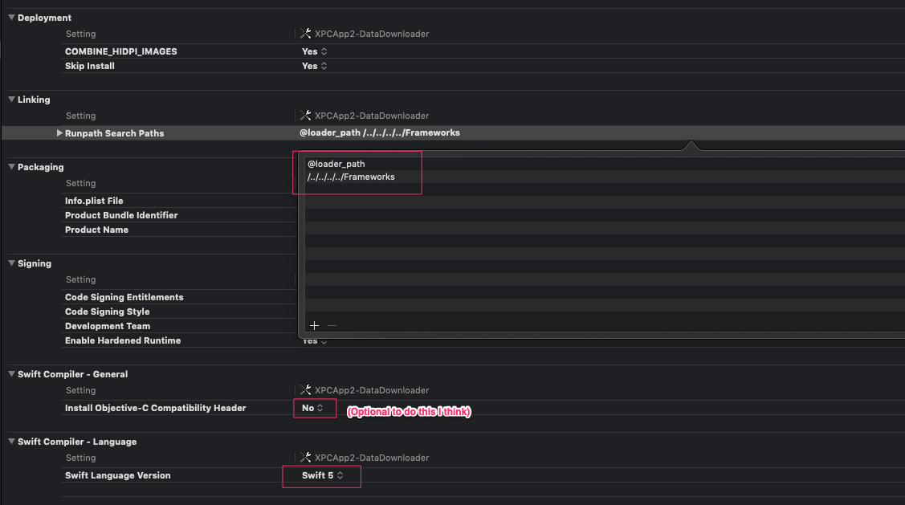

# XPCApp2

A followup to [XPC-App](https://github.com/mredig/XPC-App) where I attempted to reestablish the techniques I learned with minimal reference to the previous project and none at all to the article.

Note that for the simplicity of this app, I had to make the following changes to the build settings to make the XPC service written entirely in swift:

Further experimentation has suggested that you don't need to do anything beyond just change the swift language version if you're not doing anything with frameworks. If you ARE doing something with frameworks directly embedded in the XPC service, this seemed to be the magic sauce to make it work:
* `$(inherited)`
* `@executable_path/../Frameworks`
* `@loader_path/../Frameworks`
* `@executable_path/../../../../../../../Frameworks`
